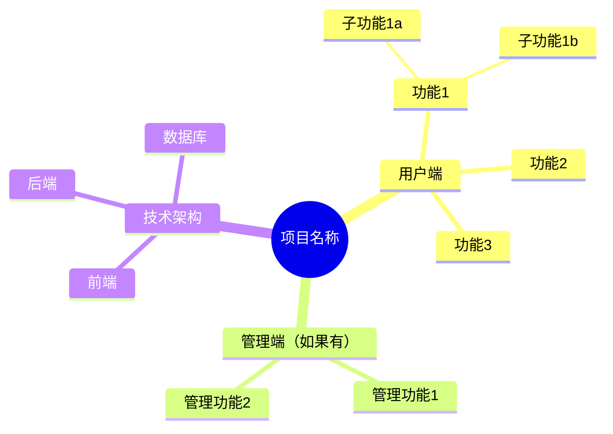
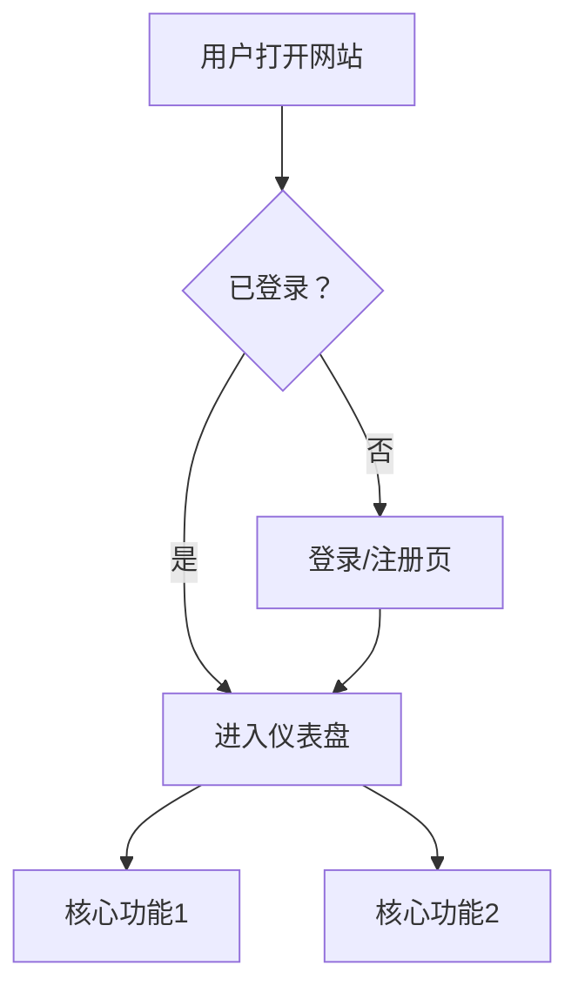

# PRD — 项目需求书（反向提问式）

**铁律：不写PRD，不写代码。**

通过反向提问的方式，一步步从用户脑中把需求提取出来，直到双方都确认"需求清楚了"为止。

## 当用户说 /prd 时

### 第一轮：核心三问（必须先回答）

**逐个问**，不要一次性抛出所有问题：

**Q1: 你要做什么？**
> 用一句话描述你想做的东西

**Q2: 给谁用？**
> 谁是你的用户？他们有什么痛点？

**Q3: 做到什么程度算完成？**
> 用户能做什么事就算MVP完成？

---

### 第二轮：功能深挖（根据Q1-Q3的回答追问）

**针对每个功能点，追问**：

```
"你说想要 [功能X]，具体来说：
 - 用户怎么触发这个功能？（点按钮？自动？）
 - 成功后用户看到什么？（页面跳转？提示？）
 - 如果失败呢？（报错？重试？）
 - 有没有特殊情况？（没登录？没数据？手机上？）"
```

**继续追问直到**：
- 每个功能的输入、处理、输出都清楚
- 边界情况都考虑到了
- 用户说"够了，就这些"

---

### 第三轮：非功能需求（快速过一遍）

| 维度 | 问题 |
|------|------|
| **设计风格** | 喜欢什么风格？有参考网站吗？ |
| **设备适配** | 主要在手机还是电脑上用？ |
| **性能要求** | 有多少用户？需要多快？ |
| **数据** | 需要存什么数据？用户数据怎么处理？ |
| **安全** | 需要登录吗？有敏感数据吗？ |
| **多语言** | 只中文？还是中英文？ |
| **SEO** | 需要被搜索引擎找到吗？ |

---

### 第四轮：生成思维导图确认

**用 Mermaid mindmap 画出整个项目结构**，让用户一眼看清逻辑：



**问用户**：
> "看看这个思维导图，逻辑对不对？有没有漏掉什么？有没有多余的？"

根据反馈修改，直到用户说"OK"。

---

### 第五轮：生成正式PRD文档

确认无误后，输出完整的项目需求书：

```markdown
# [项目名称] — 项目需求书 (PRD)
> 版本：v1.0 | 日期：YYYY-MM-DD | 状态：已确认

## 1. 项目概述
- 一句话描述：
- 目标用户：
- 核心价值：
- MVP范围：

## 2. 功能清单
### 2.1 核心功能（MVP必须有）
| 功能 | 描述 | 优先级 |
|------|------|--------|
| | | P0 |

### 2.2 增强功能（第二版加）
| 功能 | 描述 | 优先级 |
|------|------|--------|
| | | P1 |

### 2.3 未来功能（以后再说）
| 功能 | 描述 | 优先级 |
|------|------|--------|
| | | P2 |

## 3. 页面清单
| 页面 | 功能 | 核心元素 |
|------|------|----------|
| | | |

## 4. 技术方案
- 前端：
- 后端：
- 数据库：
- 部署：
- 第三方服务：

## 5. 数据模型
[ER图或表结构]

## 6. API接口清单
| 接口 | 方法 | 描述 |
|------|------|------|
| | | |

## 7. 非功能需求
- 设计风格：
- 设备适配：
- 性能指标：
- 安全要求：

## 8. 里程碑
| 阶段 | 内容 | 预计时间 |
|------|------|----------|
| M1 | | |
| M2 | | |
| M3 | | |

## 9. 风险和依赖
| 风险 | 影响 | 应对 |
|------|------|------|
| | | |
```

### 第六轮：最终确认

**生成完整的流程图**（用 Mermaid flowchart），展示用户使用流程：



**最后问用户**：
> "PRD完成了。确认以下几点：
> 1. 思维导图的结构对吗？
> 2. 用户流程图的逻辑对吗？
> 3. 功能优先级对吗？
> 4. 技术方案OK吗？
> 全部确认后，我们就开始 /checklist 准备材料，然后开工！"

---

## 反向提问原则

1. **一次只问一个问题** — 不要问题轰炸
2. **用用户听得懂的话** — 不说技术黑话
3. **给选项** — "你想要A还是B？" 比 "你想要什么？" 好回答
4. **适时总结** — 每几个问题后总结一下，防止跑偏
5. **敢说不** — 如果用户的需求不合理，温和但直接指出来
6. **帮用户想** — 用户没想到的边界情况，主动提出来
7. **控制范围** — MVP就是MVP，不要让用户把第二版的功能塞进来

## PRD完成后的流程
```
/prd 确认完毕
    ↓
/checklist 生成准备清单
    ↓
准备齐全
    ↓
/build 开始开发
```
