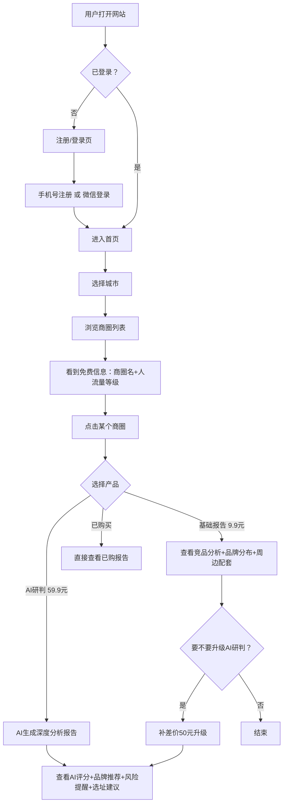
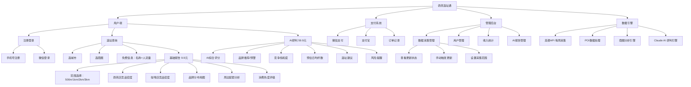

# 奶茶选址通 — 项目需求书 (PRD)
> 版本：v2.0 | 日期：2026-03-31 | 状态：已确认（validate验证后调整）

## 1. 项目概述
- **一句话描述**：专注奶茶咖啡赛道的AI选址顾问，帮加盟商用数据+AI判断"这个位置能不能开店"
- **目标用户**：奶茶/咖啡品牌的加盟商（正在选址 + 考虑加盟的观望者）
- **核心价值**：不卖数据，卖建议。花9.9元看商圈竞品分析，花59.9元让AI告诉你"这里适不适合开蜜雪冰城/瑞幸"
- **MVP范围**：1个城市，奶茶+咖啡品类，商圈分析+AI研判，微信/支付宝支付
- **差异化定位**：不做通用选址工具（打不过上上参谋），只做奶茶咖啡，做到最深最专

## 2. 竞品对比（validate验证结论）
| 对比维度 | 上上参谋 | 窄门餐眼 | 奶茶选址通（我们） |
|---------|---------|---------|------------------|
| 品类覆盖 | 全品类 | 全餐饮 | 只做奶茶+咖啡 |
| 数据深度 | 广但浅 | 品牌数据为主 | 奶茶咖啡极深 |
| 核心功能 | 看数据 | 看数据 | **AI帮你做决策** |
| 用户量 | 2499万 | 32万 | 从0开始 |
| 定价 | 会员制 | 会员制 | 按次付费，门槛低 |

## 3. 功能清单

### 3.1 核心功能（MVP）
| 功能 | 描述 | 优先级 |
|------|------|--------|
| 用户注册登录 | 手机号注册 + 微信登录，注册后才能查询 | P0 |
| 城市选择 | 用户选择要查询的城市（MVP先做1个城市） | P0 |
| 商圈浏览 | 展示该城市所有商圈，免费看：商圈名称+人流量 | P0 |
| 付费解锁基础报告 | 9.9元/次，解锁单个商圈的竞品分析报告 | P0 |
| AI选址研判 | 59.9元/次，AI分析"这个位置适不适合开XX品牌" | P0 |
| 微信支付 | 接入微信支付 | P0 |
| 支付宝支付 | 接入支付宝支付 | P0 |
| 订单记录 | 用户查看购买历史和已解锁报告 | P0 |
| 数据自动采集 | 通过高德API每周自动更新商圈数据 | P0 |

### 3.2 增强功能（v2）
| 功能 | 描述 | 优先级 |
|------|------|--------|
| 美团/饿了么销量数据 | 接入外卖平台数据，展示门店销量排名 | P1 |
| 会员制 | 包月/包年随便查 | P1 |
| 多城市扩展 | 增加更多城市的数据覆盖 | P1 |
| 开店/关店动态 | 最近3个月该商圈奶茶咖啡店开关情况 | P1 |

### 3.3 未来功能（以后再说）
| 功能 | 描述 | 优先级 |
|------|------|--------|
| 品牌定制推荐 | 输入品牌名，推荐最适合的商圈 | P2 |
| 历史数据趋势 | 展示商圈竞品密度变化趋势 | P2 |
| 竞品预警 | 某商圈新开了奶茶/咖啡店，推送通知 | P2 |
| 选址社区 | 加盟商交流选址经验 | P2 |

## 4. 数据维度（奶茶咖啡专属）

### 免费可见
- 商圈名称
- 商圈人流量等级（高/中/低）

### 基础报告（9.9元）
- **范围选择**：用户可选 500米 / 1公里 / 2公里 / 3公里（默认1公里）
- 所选范围内奶茶店数量（竞品密度）
- 所选范围内咖啡店数量
- 已进驻品牌列表（蜜雪冰城、瑞幸、喜茶、库迪等）
- 品牌分布地图（可切换范围查看）
- 周边人口/写字楼/学校等配套
- 该商圈奶茶咖啡消费热度评级

### AI研判报告（59.9元）
- 基础报告的全部内容
- AI综合评分（1-100分）
- "适合开什么品牌"推荐
- "不适合开什么品牌"预警
- 竞争饱和度分析（该区域还能不能再开一家）
- 预估客流量和日均杯数
- 选址建议（具体开在哪个位置最好）
- 风险提醒（租金过高？竞品太多？人群不匹配？）

## 5. 页面清单
| 页面 | 功能 | 核心元素 |
|------|------|----------|
| 首页/落地页 | 产品介绍，引导注册 | "奶茶咖啡选址，AI帮你做决定"、成功案例、CTA |
| 注册/登录页 | 用户注册和登录 | 手机号+验证码、微信登录 |
| 城市选择页 | 选择城市 | 城市列表（MVP只有1个城市） |
| 商圈列表页 | 浏览商圈 | 商圈卡片（名称+人流量+奶茶店数量预览）、搜索/筛选 |
| 商圈详情页 | 查看报告 | 未付费：模糊数据+付费按钮；已付费：完整报告 |
| AI研判页 | AI分析报告 | 评分仪表盘、品牌推荐、风险提醒、地图可视化 |
| 支付页 | 完成支付 | 两种产品选择（9.9基础/59.9 AI）、支付方式 |
| 我的报告页 | 查看已购报告 | 报告列表、状态（基础/AI）、再次查看入口 |
| 个人中心 | 账号管理 | 用户信息、退出登录 |

## 6. 技术方案
- **前端**：React + Vite + Tailwind CSS（响应式，手机电脑兼顾）
- **后端**：FastAPI（Python）
- **数据库**：PostgreSQL
- **数据源**：高德地图API（每周定时采集奶茶/咖啡POI数据）
- **AI引擎**：Claude API（生成AI研判报告）
- **支付**：微信支付 + 支付宝（官方SDK）
- **部署**：待定
- **SEO**：服务端渲染(SSR)或预渲染，确保搜索引擎收录

## 7. 数据模型

```
用户表 (users)
├── id（用户ID）
├── phone（手机号）
├── wechat_openid（微信ID）
├── nickname（昵称）
├── created_at（注册时间）

商圈表 (business_districts)
├── id（商圈ID）
├── city（城市）
├── name（商圈名称）
├── location（经纬度）
├── foot_traffic_level（人流量等级）——免费可见
├── updated_at（数据更新时间）

门店表 (shops)
├── id（门店ID）
├── district_id（所属商圈ID）
├── name（店名）
├── brand（品牌名：蜜雪冰城/瑞幸/喜茶等）
├── category（分类：奶茶/咖啡）
├── location（经纬度）
├── address（详细地址）
├── rating（评分）
├── updated_at（数据更新时间）

商圈分析表 (district_analysis)
├── id
├── district_id（商圈ID）
├── tea_shop_count（奶茶店数量）
├── coffee_shop_count（咖啡店数量）
├── brand_distribution（品牌分布JSON）
├── surrounding_facilities（周边配套JSON：写字楼/学校/小区数量）
├── consumption_heat（消费热度评级）
├── competition_saturation（竞争饱和度）
├── analysis_date（分析日期）

AI研判报告表 (ai_reports)
├── id
├── district_id（商圈ID）
├── user_id（用户ID）
├── ai_score（AI评分 1-100）
├── recommended_brands（推荐品牌JSON）
├── warning_brands（预警品牌JSON）
├── estimated_daily_cups（预估日均杯数）
├── risk_factors（风险因素JSON）
├── site_suggestion（选址建议）
├── full_report（完整报告内容）
├── created_at（生成时间）

订单表 (orders)
├── id（订单ID）
├── user_id（用户ID）
├── district_id（商圈ID）
├── amount（金额：9.9 / 59.9）
├── product_type（产品类型：basic_report / ai_report）
├── payment_method（支付方式：wechat / alipay）
├── payment_status（支付状态）
├── created_at（下单时间）
├── paid_at（支付时间）
```

## 8. API接口清单
| 接口 | 方法 | 描述 |
|------|------|------|
| /api/auth/register | POST | 手机号注册 |
| /api/auth/login | POST | 手机号+验证码登录 |
| /api/auth/wechat | POST | 微信登录 |
| /api/cities | GET | 获取可用城市列表 |
| /api/districts | GET | 获取某城市的商圈列表（含免费信息） |
| /api/districts/{id} | GET | 获取商圈详情（根据是否付费返回不同内容） |
| /api/districts/{id}/shops | GET | 获取商圈内奶茶/咖啡门店列表（付费） |
| /api/districts/{id}/ai-report | POST | 生成AI研判报告（59.9元） |
| /api/reports | GET | 获取用户已购报告列表 |
| /api/reports/{id} | GET | 查看单个报告详情 |
| /api/orders | POST | 创建支付订单 |
| /api/orders | GET | 获取用户订单列表 |
| /api/payment/wechat/callback | POST | 微信支付回调 |
| /api/payment/alipay/callback | POST | 支付宝支付回调 |

## 9. 非功能需求
- **设计风格**：简洁专业，主色调暖橙/茶色（契合奶茶咖啡调性），商务但不冰冷
- **设备适配**：响应式设计，手机+电脑都兼顾
- **性能指标**：页面加载 < 2秒，AI报告生成 < 30秒
- **安全要求**：用户数据加密存储，支付走官方SDK，HTTPS
- **语言**：纯中文
- **SEO**：核心关键词"奶茶选址"、"咖啡开店选址"、"奶茶加盟选址"、"AI选址"

## 10. 里程碑
| 阶段 | 内容 | 说明 |
|------|------|------|
| M1 | 基础框架 | 前后端骨架、数据库、用户注册登录 |
| M2 | 数据采集 | 高德API对接、奶茶咖啡POI数据采集、商圈分析 |
| M3 | 核心功能 | 商圈浏览、基础报告展示、付费解锁 |
| M4 | AI研判 | Claude API对接、AI报告生成、报告页面 |
| M5 | 支付系统 | 微信+支付宝支付、订单系统 |
| M6 | SEO+上线 | SEO优化、部署上线、首个城市数据导入 |

## 11. 风险和依赖
| 风险 | 影响 | 应对 |
|------|------|------|
| 高德API费用 | 数据采集成本 | 先查清免费额度，控制调用频率 |
| Claude API费用 | AI报告生成成本 | 59.9元定价覆盖API成本，控制prompt长度 |
| 支付资质 | 需要企业资质才能接入微信/支付宝 | 提前准备营业执照等材料 |
| 数据准确性 | 用户信任度 | 标注数据来源和更新时间，加免责声明 |
| SEO见效慢 | 初期流量少 | 同步用其他渠道推广（小红书、抖音、加盟社群） |
| AI幻觉风险 | 给出错误建议 | 加"仅供参考"声明，结合真实数据约束AI输出 |

## 12. 用户流程图



## 13. 项目组织结构图


