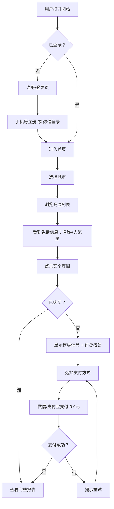

# 加盟点位通 — 项目需求书 (PRD)
> 版本：v1.0 | 日期：2026-03-31 | 状态：已确认

## 1. 项目概述
- **一句话描述**：为加盟商提供商圈选址数据查询服务，按次付费解锁详细分析
- **目标用户**：正在选址的加盟商 + 考虑加盟的观望者
- **核心价值**：不用实地考察，花9.9元就能看到一个商圈的人流量、竞品分布等关键数据，辅助开店选址决策
- **MVP范围**：1个城市，商圈数据查询+付费解锁，微信/支付宝支付

## 2. 功能清单

### 2.1 核心功能（MVP必须有）
| 功能 | 描述 | 优先级 |
|------|------|--------|
| 用户注册登录 | 手机号注册 + 微信登录，注册后才能查询 | P0 |
| 城市选择 | 用户选择要查询的城市（MVP先做1个城市） | P0 |
| 商圈浏览 | 展示该城市所有商圈列表，显示免费信息（名称+人流量） | P0 |
| 付费解锁 | 支付9.9元解锁单个商圈的完整报告 | P0 |
| 完整报告页 | 展示竞品详情、周边分析、选址建议 | P0 |
| 微信支付 | 接入微信支付 | P0 |
| 支付宝支付 | 接入支付宝支付 | P0 |
| 订单记录 | 用户查看自己的购买历史和已解锁报告 | P0 |
| 数据自动采集 | 通过高德API每周自动更新商圈数据 | P0 |

### 2.2 增强功能（第二版加）
| 功能 | 描述 | 优先级 |
|------|------|--------|
| AI研判报告 | AI深度分析商圈，生成选址建议报告，59.9元/次 | P1 |
| 会员制 | 包月/包年随便查 | P1 |
| 多城市扩展 | 增加更多城市的数据覆盖 | P1 |

### 2.3 未来功能（以后再说）
| 功能 | 描述 | 优先级 |
|------|------|--------|
| 品牌定制分析 | 根据不同品牌类型推荐合适商圈 | P2 |
| 历史数据趋势 | 展示商圈数据的变化趋势 | P2 |
| 竞品预警 | 某商圈新开了同类店铺，通知用户 | P2 |

## 3. 页面清单
| 页面 | 功能 | 核心元素 |
|------|------|----------|
| 首页/落地页 | 产品介绍，引导注册 | 标语、功能介绍、CTA按钮、SEO关键词 |
| 注册/登录页 | 用户注册和登录 | 手机号输入、验证码、微信登录按钮 |
| 城市选择页 | 选择要查询的城市 | 城市列表/地图（MVP只有1个城市） |
| 商圈列表页 | 浏览该城市所有商圈 | 商圈卡片（名称+人流量）、搜索/筛选 |
| 商圈详情页 | 查看商圈完整报告 | 未付费：模糊信息+付费按钮；已付费：完整数据 |
| 支付页 | 完成支付 | 价格、微信/支付宝选择、支付确认 |
| 我的订单页 | 查看购买历史 | 订单列表、已解锁报告入口 |
| 个人中心 | 账号管理 | 用户信息、退出登录 |

## 4. 技术方案
- **前端**：React + Vite + Tailwind CSS（响应式，手机电脑兼顾）
- **后端**：FastAPI（Python）
- **数据库**：PostgreSQL
- **数据源**：高德地图API（每周定时采集）
- **支付**：微信支付 + 支付宝（官方SDK）
- **部署**：待定
- **SEO**：服务端渲染(SSR)或预渲染，确保搜索引擎收录

## 5. 数据模型

```
用户表 (users)
├── id（用户ID）
├── phone（手机号）
├── wechat_openid（微信ID）
├── nickname（昵称）
├── created_at（注册时间）

商圈表 (business_districts)
├── id（商圈ID）
├── city（城市）
├── name（商圈名称）
├── location（经纬度）
├── foot_traffic（人流量）——免费可见
├── competitor_count（竞品数量）——付费可见
├── competitor_details（竞品详情JSON）——付费可见
├── surrounding_analysis（周边分析）——付费可见
├── site_suggestion（选址建议）——付费可见
├── updated_at（数据更新时间）

订单表 (orders)
├── id（订单ID）
├── user_id（用户ID）
├── district_id（商圈ID）
├── amount（金额：9.9 / 59.9）
├── product_type（产品类型：basic / ai_report）
├── payment_method（支付方式：wechat / alipay）
├── payment_status（支付状态）
├── created_at（下单时间）
├── paid_at（支付时间）
```

## 6. API接口清单
| 接口 | 方法 | 描述 |
|------|------|------|
| /api/auth/register | POST | 手机号注册 |
| /api/auth/login | POST | 手机号+验证码登录 |
| /api/auth/wechat | POST | 微信登录 |
| /api/cities | GET | 获取可用城市列表 |
| /api/districts | GET | 获取某城市的商圈列表（含免费信息） |
| /api/districts/{id} | GET | 获取商圈详情（根据是否付费返回不同内容） |
| /api/orders | POST | 创建支付订单 |
| /api/orders | GET | 获取用户订单列表 |
| /api/payment/wechat/callback | POST | 微信支付回调 |
| /api/payment/alipay/callback | POST | 支付宝支付回调 |

## 7. 非功能需求
- **设计风格**：简洁专业，类似企查查，配色商务蓝/白
- **设备适配**：响应式设计，手机+电脑都兼顾
- **性能指标**：页面加载 < 2秒，支付响应 < 3秒
- **安全要求**：用户数据加密存储，支付走官方SDK，HTTPS
- **语言**：纯中文
- **SEO**：核心关键词"加盟选址"、"商圈分析"、"开店选址"需有排名

## 8. 里程碑
| 阶段 | 内容 | 说明 |
|------|------|------|
| M1 | 基础框架 | 前后端骨架、数据库、用户注册登录 |
| M2 | 核心功能 | 商圈数据展示、付费解锁、高德数据对接 |
| M3 | 支付上线 | 微信+支付宝支付、订单系统 |
| M4 | SEO+上线 | SEO优化、部署上线、首个城市数据导入 |

## 9. 风险和依赖
| 风险 | 影响 | 应对 |
|------|------|------|
| 高德API费用 | 数据采集成本 | 先查清免费额度，控制调用频率 |
| 支付资质 | 需要企业资质才能接入微信/支付宝 | 提前准备营业执照等材料 |
| 数据准确性 | 用户信任度 | 标注数据来源和更新时间 |
| SEO见效慢 | 初期流量少 | 同步用其他渠道推广（社群、短视频） |

## 10. 用户流程图


